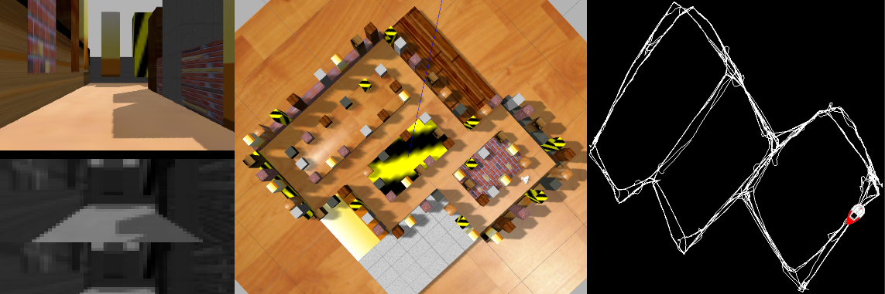

# PG: RatSLAMROS and OpenBase integration

A [ROS](https://www.ros.org/) package that provides the enviroment needed to test the ROS version of [RatSLAM](https://github.com/davidmball/ratslam/blob/wiki/RatSLAMROS.md) using the robot provided by the ROS version of [OpenBase](https://github.com/GuiRitter/OpenBase).

The main reason for this package was to try and use RatSLAMROS in a consistent enviroment. For this, the package relies on the use of the ROS version the OpenBase robot; so in order to use this package there are a series of steps that need to be followed wich are addressed later on. 

The package provides a [Gazebo](http://gazebosim.org/) world  model, and couple of simple programs in order for the robot to move by itself or by following commands from the keyboard. All of this has been made taking into consideration what appears to be the two main problems regarding the use of RatSLAM:
1 Being able to recognize the same location again.
2 Avoid to mistakenly recognize 2 different places, with similar visual inputs, as the same.

To explain this 2 problems let's first introduce the idea of position and pose for a robot in a 2 dimensional map:
- The position of a robot is the location within the map, easily represented with 2 values X,Y that state the distance along to axis from a specific point of reference.
- The pose of a robot is the combination of position and the orientation (where the robot is facing) of said robot, with the later represented by the angle of rotation arround a Z axis (perpendicular to the floor in this case).
We then have position (X,Y) and pose (X,Y,θ).

The first problem comes from the fact that RatSLAM makes a 2D sketch of the map seen by drawing lines to represent the path taken by the robot, with each point of that line representing

