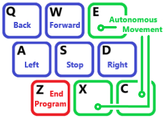

# PG: RatSLAMROS and OpenBase integration

A [ROS](https://www.ros.org/) package that provides the enviroment needed to test the ROS version of [RatSLAM](https://github.com/davidmball/ratslam/blob/wiki/RatSLAMROS.md) using the robot provided by the ROS version of [OpenBase](https://github.com/GuiRitter/OpenBase).

The main reason for this package was to try and use RatSLAMROS in a consistent enviroment. For this, the package relies on the use of the ROS version the OpenBase robot; therefore in order to use this package there are a series of steps that need to be followed wich are addressed later on in the Install section. 

## Adressed problems

The package provides a [Gazebo](http://gazebosim.org/) world  model, and couple of simple programs in order for the robot to move by itself or by following commands from the keyboard. All of this has been made taking into consideration what appears to be the two main complications regarding the use of RatSLAM:
1. Being able to recognize the same location again.
2. Avoid to mistakenly recognize two different places, with similar visual inputs, as the same.

To explain this two problems let's first introduce the idea of position and pose for a robot in a two dimensional map:
- The position of a robot is the location within the map, easily represented with two values X,Y that state the distance along two axis from a specific point of reference.
- The pose of a robot is the combination of position and the orientation (where the robot is facing) of said robot, with the later represented by the angle of rotation arround a Z axis (perpendicular to the floor in this case).
We then have position (X,Y), and pose (X,Y,θ).


The first complication comes from the fact that RatSLAM makes a 2D sketch of the map seen, by drawing lines to represent the path taken by the robot, with each point of that line representing a place in the map. The problem is that in a 2D map each point can only represent a position, but in this case is trying to represent a pose (due to the way that the system works, wich depends on the orientation of the robot's camera); and because of this there can (and will) be two or more points, distant from each other, that are representing the same position (X,Y). And this leads to really bad representation of the map.
One way to adress part of this problem (with the purpose of adquiring results that are easier to analize) is to limit the way the robot moves on the map. In this case it was decided to follow the example of the datasets provided by the autors, and limit the robot movement along specific paths or "roads". This limits the amount of diferent positions and poses for the robot, but even by traveling in a straight line, we still need to know if we are going one direction or the other.


This problem is engaged by the program responsable of the movement of the robot by making turns from one direction to the opposite one, trying to set a relationship between the same position with the 2 opposite directions in differet points on the map.


The second complication comes from the fact that 2 diferent places can look alike, and since the robot position estimation relies heavily (or completely) on the visual input, the robot can mistake one place for another.
When one of this mistakes is done, the system will then believe that 2 diferent places are the same, and this single error can "destroy" a map.


To adress this problem, the world model was made with a certain combination of visual cues along the roads that attempt to make every single place visualy unique.


## Installing PG
This package has only been tested on [Ubuntu 16.04](http://releases.ubuntu.com/16.04/) with [ROS Kinetic](http://wiki.ros.org/kinetic).

#### ROS Kinetic
This steps come from this 2 tutorials: [1](http://wiki.ros.org/kinetic/Installation/Ubuntu)
[2](http://wiki.ros.org/ROS/Tutorials/InstallingandConfiguringROSEnvironment).
```
sudo sh -c 'echo "deb http://packages.ros.org/ros/ubuntu $(lsb_release -sc) main" > /etc/apt/sources.list.d/ros-latest.list'
sudo apt-key adv --keyserver hkp://ha.pool.sks-keyservers.net:80 --recv-key 421C365BD9FF1F717815A3895523BAEEB01FA116
sudo apt-get update
sudo apt-get install ros-kinetic-desktop-full
sudo rosdep init
rosdep update
echo "source /opt/ros/kinetic/setup.bash" >> ~/.bashrc
source ~/.bashrc
sudo apt install python-rosinstall python-rosinstall-generator python-wstool build-essential
mkdir -p ~/catkin_ws/src
cd ~/catkin_ws/
catkin_make
echo "source ~/catkin_ws/devel/setup.bash" >> ~/.bashrc
source ~/.bashrc
sudo apt-get install ros-kinetic-gazebo-ros-pkgs ros-kinetic-gazebo-ros-control
```
#### RatSLAMROS
This steps follows the tutorial given by the creators: [3](https://github.com/davidmball/ratslam/blob/wiki/RatSLAMROS.md
)
```
sudo apt-get install libirrlicht-dev
sudo apt-get install libopencv-dev
cd ~/catkin_ws/src
git clone https://github.com/davidmball/ratslam.git ratslam_ros
                                                                            cd ratslam_ros
                                                                            git checkout ratslam_ros
cd ~/catkin_ws
catkin_make
```
You can also download a dataset and try it following the steps given at their tutorial.
We wll later copy a configuration file to this package.

#### OpenBase
Once again this steps were made taking into consideration the creator's tutorial:  [4](https://github.com/GuiRitter/OpenBase
)
```
cd ~
git clone https://github.com/GuiRitter/OpenBase.git OpenBase
cp -r ~/OpenBase/ROS/open_base ~/catkin_ws/src/open_base
sudo apt-get install ros-kinetic-effort-controllers
sudo apt-get install ros-kinetic-joint-state-controller
sudo apt-get install ros-kinetic-position-controllers
sudo apt install ros-kinetic-controller-manager
```
We will later need to add some sensors to the robot.

#### PG
```
cd ~/catkin_ws/src
git clone https://github.com/GonzaloCrovetto/pg.git pg
                                                                            cd pg
                                                                            git checkout pg
cp -r ~/catkin_ws/src/pg/config/for_ratslam_ros/config_openBase.txt.in ~/catkin_ws/src/ratslam_ros/config/config_openBase.txt.in
cd ~/catkin_ws
catkin_make
```
Following this steps you have downloaded the PG package, and copied the config file to the ratslam_ros package.
We now need to add sensors to the open_base proyect robot, to do this, you need to copy the full content of this file:
```
 ~/catkin_ws/src/pg/config/for_open_base/sensors.txt
```
Inside this other file (without overwriting anything):
```
 ~/catkin_ws/src/open_base/xacro/main.urdf.xacro
```
Copy it (for example) between the last </joint> tag and the first <xacro:rim_macro tag (between line 61 and 62, but this might change).

## Running PG

The easiest way to try it, is to launch the pg_runAll.launch launch file:
```
 roslaunch pg pg_runAll.launch
```
You can also run the pg_LEKeyboard.exe file in another terminal in order to command the robot with the keyboard:
```
rosrun pg pg_LEKeyboard
```
A: Goes left, D: Right, W: Fordward, S: Backwards, Q: Stops the robot, Z: Ends the program, and every other key makes the robot to go back to autonomous movement.


You can also chose to run the diferent parts, in order to do that check the contents of the /launch and /src folders inside the pg proyect.
If you want to change the map settings, go to the /worlds and /models folders inside the pg proyect.

## Issues and future work

There is still plenty of work to be done in order to achieve better results from this work. 

For example, there is a current problem that makes the robot draw a big straight line at the begining of the program, wich does not correlate with the actual movement.

More work can be to be done regarding the tweaking of the different variables found at the config file for ratslam, the simulation variables set at the .world file, and the speeds that the pg_openBase_linealExplorer.cpp file sets for the robot.
The current numbers were set based on the default variables for the .world file, and from there, and following the restrictions placed by the simulation (like for example it's simulation speed), many tests were made in order to try and find a good combination of initial variable numbers. 
It is highly recommended to adress this, and try different combinations that might work better for you.
