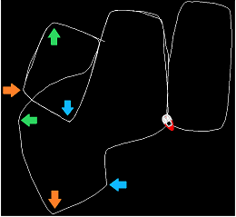

# PG: RatSLAMROS and OpenBase integration

A [ROS](https://www.ros.org/) package that provides the enviroment needed to test the ROS version of [RatSLAM](https://github.com/davidmball/ratslam/blob/wiki/RatSLAMROS.md) using the robot provided by the ROS version of [OpenBase](https://github.com/GuiRitter/OpenBase).

The main reason for this package was to try and use RatSLAMROS in a consistent enviroment. For this, the package relies on the use of the ROS version the OpenBase robot; therefore in order to use this package there are a series of steps that need to be followed wich are addressed later on in the Install section. 

The package provides a [Gazebo](http://gazebosim.org/) world  model, and couple of simple programs in order for the robot to move by itself or by following commands from the keyboard. All of this has been made taking into consideration what appears to be the two main complications regarding the use of RatSLAM:
1. Being able to recognize the same location again.
2. Avoid to mistakenly recognize two different places, with similar visual inputs, as the same.

To explain this two problems let's first introduce the idea of position and pose for a robot in a two dimensional map:
- The position of a robot is the location within the map, easily represented with two values X,Y that state the distance along two axis from a specific point of reference.
- The pose of a robot is the combination of position and the orientation (where the robot is facing) of said robot, with the later represented by the angle of rotation arround a Z axis (perpendicular to the floor in this case).
We then have position (X,Y), and pose (X,Y,θ).

The first complication comes from the fact that RatSLAM makes a 2D sketch of the map seen, by drawing lines to represent the path taken by the robot, with each point of that line representing a place in the map. The problem is that in a 2D map each point can only represent a position, but in this case is trying to represent a pose (due to the way that the system works, wich depends on the orientation of the robot's camera); and because of this there can, and will, be two or more points distant from each other that are representing the same position (X,Y). And this leads to really bad representation of the map.
One way to adress part of this problem (with the purpose of adquiring results that are easier to analize) is to limit the way the robot moves on the map. In this case it was decided to follow the example of the datasets provided by the autors, and limit the robot movement along specific paths or "roads". This limits the amount of diferent positions and poses for the robot, but even by traveling in a straight line, we still need to know if we are going one direction or the other.

This problem is engaged by the program responsable of the movement of the robot by making turns from one direction to the opposite one, trying to set a relationship between the same position with the 2 opposite directions in differet points on the map.

The second complication comes from the fact that 2 diferent places can look alike, and since the robot position estimation relies heavily (or completely) on the visual input, the robot can mistake one place for another.
When one of this mistakes is done, the system will then believe that 2 diferent places are the same, and this single error can "destroy" a map.

To adress this problem, the world model was made with a certain combination of visual cues along the roads that attempt to make every single place visualy unique.

